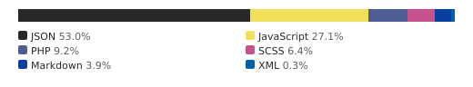

# 👋 Welcome to Ajaxify Comments

<!-- aidevops:badges:start -->
<!-- managed by aidevops badges; edit the template, not this block -->
<!-- Build & Quality Status -->
[](https://github.com/Ultimate-Multisite/wp-ajaxify-comments/actions/workflows/loc-badge.yml)

<!-- License & Legal -->
[](https://github.com/Ultimate-Multisite/wp-ajaxify-comments/blob/main/LICENSE)

<!-- Repository Metrics -->
[](docs/metrics/repo-metrics.md)
[](docs/metrics/repo-metrics.md)
[](docs/metrics/repo-metrics.md)

<!-- Project Links -->
[](https://github.com/Ultimate-Multisite/wp-ajaxify-comments)
<!-- aidevops:badges:end -->

> Spin up [a test site of the plugin](https://app.instawp.io/launch?t=ajaxify-comments&d=v2).

Ajaxify Comments allows you to post comments without a page reload. As a bonus, error messages that normally require a page reload for the user are also inline.


## 🔗 Quick Links

* <a href="https://wordpress.org/plugins/wp-ajaxify-comments/">WordPress.org plugin page</a>
* <a href="https://dlxplugins.com/plugins/ajaxify-comments/">Ajaxify Comments Landing/Marketing Page</a>
* <a href="https://docs.dlxplugins.com/v/ajaxify-comments/">Documentation</a>

## Support

* <a href="https://wordpress.org/support/plugin/wp-ajaxify-comments/">WordPress.org support</a>
* <a href="https://dlxplugins.com/support/">DLX Plugins support</a>

## Developers

* <a href="https://docs.dlxplugins.com/v/ajaxify-comments/developers/actions-and-filters">Actions and Filters</a>
* <a href="https://docs.dlxplugins.com/v/ajaxify-comments/developers/script-debugging">Script Debugging</a>

### JavaScript events

Ajaxify Comments dispatches lifecycle events on `document`. These events do not require the corresponding callback setting to be configured.

Use `wpacAfterUpdateComments` to initialize functionality after the comments and comment form have been replaced. It runs after comment submission, pagination, lazy loading, and automatic or manual refreshes.

```js
document.addEventListener( 'wpacAfterUpdateComments', function( event ) {
	const { commentUrl, newDom } = event.detail;
	// Initialize functionality for the updated comments.
} );
```

Use `wpacAfterPostComment` when the server has accepted a submitted comment but before the comments are replaced. Its event detail contains `commentUrl` and the `unapproved` moderation status.

Both events can also be handled through jQuery. Access their details through `event.originalEvent.detail`:

```js
jQuery( document ).on( 'wpacAfterUpdateComments', function( event ) {
	const { commentUrl, newDom } = event.originalEvent.detail;
} );
```

<!-- aidevops:managed-readme:start -->
<!-- managed by aidevops; refresh with managed-readme-helper.sh sync -->
## Star History


## Built with aidevops

This project was created and is maintained with
[aidevops.sh](https://aidevops.sh).

[View Ultimate-Multisite on GitHub](https://github.com/Ultimate-Multisite) ·
[aidevops repository](https://github.com/marcusquinn/aidevops)
<!-- aidevops:managed-readme:end -->
